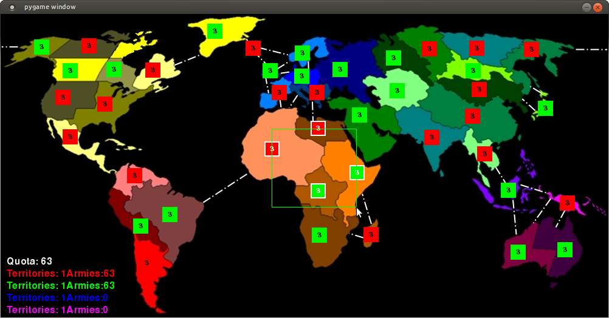

Based on [Real Time Risk by davidMcneil](https://github.com/davidMcneil/Real-Time-Risk)

*Note: Must have python and pygame installed*

# To Start Game:

- unzip directory into desired location, this path is hence called directory

## Linux

- open terminal
- "cd directory"

Start a server:

- run "python server.py arg1 arg2"
  - arg1 = port number
  - arg2 = number of players 1-4
- ex.) "python server.py 5555 3" starts game on port 5555 with 3 players

Start specified number of clients one for each player:

- run "python client.py arg1 arg2"
  - arg1 = port number same as server
  - arg2 = host machines IP address
- ex.) "python client.py 127.0.0.1 5555" connects to local-host on port 5555

*Note: Game only starts after all clients have connected*

# Game Play
- Right click to select country to move armies from
- Left click to move armies into adjacent country
- Number keys change quantity of armies moved

*Note: The game quickly digresses into maniacal clicking*
